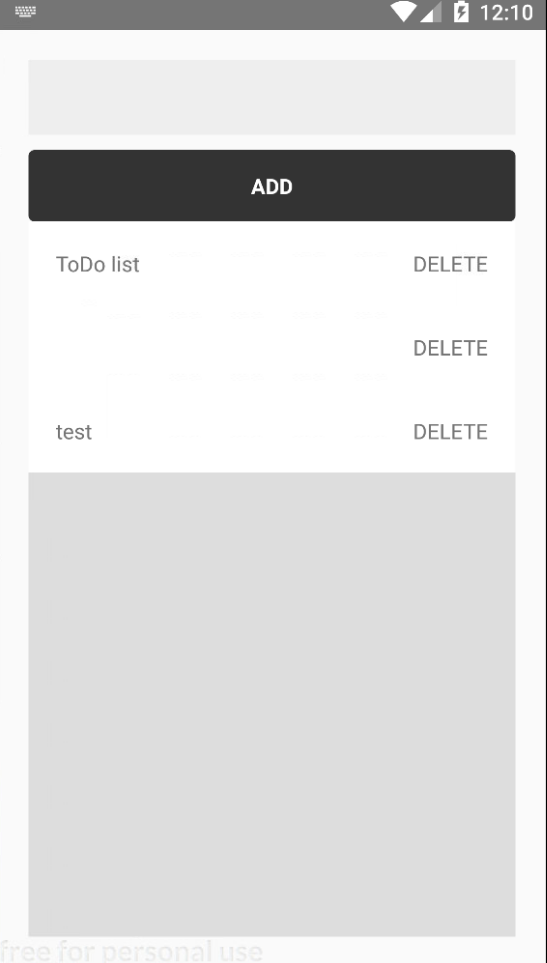

# Todoアプリ

## 概要
ReactNativeを学習するためにTodoアプリを作成しました。
### 実装画面 
Samsung Galaxy S7 API23  



## 要件
ReactNative  
Node.js v10.12.0  
java 
Android SDK 6.0  
genymotion personal
Android Studio  


## 使い方

フォルダ内で以下のコマンドを実行
```bash
$ npm install
```


Android Studioかgenymotion personalのエミュレータ上で起動します。
```bash
$ react-native run-android
```
